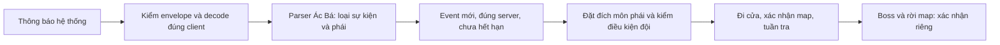

# Ác Bá — rà soát và đề xuất nhận diện môn phái

Ngày 10-10-2026. Baseline **EAGLE Auto v0.5, `910020a`**, nhánh phân tích `analysis/eagle-auto-ac-ba`. Lượt này chỉ thêm báo cáo, evidence và probe phân tích; **không sửa automation, tăng version hay tạo bản EXE mới**. Stable116, licensing/VIP, hook/offsets, resource và các module đã sửa giữ nguyên. Không chạy/load EXE automation hoặc native DLL.

**Kết luận:** Có thể phát triển chức năng tự nhận diện Ác Bá rồi dẫn đội đến môn phái đang có sự kiện, vì private client có thông báo hệ thống chứa NPC và môn phái. Source107 **đã có phần nhận diện**, nhưng parser và bộ điều phối hiện tại còn nhiều hạn chế. Việc vào phụ bản bằng đội trưởng khác môn phái chưa được xác minh; nếu server bắt buộc đúng phái thì vẫn phải có thành viên hợp lệ của phái đó, không được bỏ điều kiện server.

## Phạm vi và bằng chứng

Rà soát `ItemAcBa_Click`/menu/reset, `WndProc`/decoder VISCII, đăng ký recv hook trong `Auto`, `AcBa`/`IsAcBa`/`IsAlarmAcBa`, handoff đội trưởng, `DatDoiAcBa`, `TLBB.MapMonPhai`/`MapAcBa`, `IsMapAcBa`/`IsMapPhuBan`, `AcBaPoint`, `Setting.LoadMAP`, resource MapPath, POINT/MoveNext/Next/FixKetMap, Party/TrieuTap/AskTeamFollow, boss/timer/Auto OFF/ClearMission/calendar, Objects/GameObject/QuestFrame và các module có cờ xung đột.

[Inventory](evidence/source-inventory.json) ghi hash input, method và mapping; `Game.cs` đang build được tái tạo redacted từ snapshot qua các review layer v0.2–v0.5. `DatDoiAcBa` và `TalkNPCPhuBan` trong v0.5 vẫn khớp nguyên snapshot. [IL DatDoiAcBa](evidence/DatDoiAcBa.il.txt), [IL MapAcBa](evidence/get_MapAcBa.il.txt), [excerpt IL nhận thông báo](evidence/WndProc.ac-ba.il.txt) được lấy từ cache IL gốc đã kiểm SHA256, không thực thi binary.

**27 probe** đã chạy thành công, xác nhận đúng các quan sát mong đợi trên selected C# thực với dependencies giả; kết quả tại [probes.json](evidence/probes.json). Đây là kiểm chứng hành vi đang có, gồm cả hành vi lỗi và hai ca nhận diện đúng; không phải 27 lỗi đã sửa, không phải kiểm thử native/Windows/game. Các thông báo trong probe là dữ liệu tổng hợp, **không phải packet hoặc nguyên văn thông báo private client**.

## Luồng hiện tại

1. Menu bật `leader.IsAcBa`, reset các cờ menu xung đột của leader.
2. `Auto` chỉ bật recv hook khi có alarm chat hoặc `FrmMain.AlarmAcBa` trên leader; `IsAcBa` không nằm trong điều kiện này.
3. `WndProc` nhận `WM_COPYDATA`, lấy PID ở bốn byte đầu, tìm chữ ký packet `DA 03` và byte phân loại4, decode body từ offset15 bằng VISCII.
4. Text chứa `gianghotieutieu` hoặc `#{qyxt_15}` cùng tên phái sẽ gán `game.AcBa` thành **ID môn phái**, không phải map. Có 11 nhánh `if` độc lập.
5. Leader khác phái sẽ tìm một nhân vật cùng đội có `Menpai == AcBa`, đặt `member.IsAcBa=true` và gọi `AppointLeader`. Dữ liệu sự kiện không được chuyển theo.
6. `DatDoiAcBa` lấy map/tuyến từ **Menpai của leader**. `AcBa=-1` cho phép đi về môn phái riêng; nếu đã biết sự kiện ở phái khác thì method return. Trong phụ bản, dùng tuyến/di chuyển và state boss chung.

Vì vậy phiên bản hiện tại chưa có một luồng ổn định kiểu “sự kiện ở Nga Mi → đặt đích Nga Mi → tập hợp đội → xác nhận đến/vào cửa”. Không thể chỉ đổi một phép so sánh Menpai là hoàn tất chức năng.

## Phát hiện

| ID | Bằng chứng và tác động | Đề xuất |
|---|---|---|
| AB01 | `WndProc` chỉ nhận hai marker NPC cũ, không kiểm câu xuất hiện/kết thúc. Probe bỏ sót NPC khác tên, alias `Nga Mi`, UTF-8; text báo đã tiêu diệt vẫn đặt target. Khi có hai tên phái, nhánh đứng sau trong code thắng. | Parser riêng nhận event lifecycle và **vai trò tên phái trong câu**, alias/config theo client, normalize một lần. Tách codec khỏi parser; không đoán codec hoặc chọn “tên phái cuối cùng” khi dữ liệu mơ hồ. |
| AB02 | `cbData` chưa được kiểm giới hạn trước allocate/copy; `ToInt32(array,0)` ngoài vùng catch của phần chat và thiếu kiểm length>=4. Probe buffer 3 byte gây ArgumentException. Scan break ở chữ ký chat riêng có thể bỏ qua chữ ký sự kiện nằm sau; body dùng offset cố định15. | Validate envelope/PID/type/length trước decode; giới hạn body và xử lý lỗi trong đường nhận event. Làm rõ contract native cho packet ghép/cắt/offset trước thay framing. Probe không gọi Marshal hay native hook. |
| AB03 | Bật `IsAcBa` không bật hook nếu mọi alarm đều OFF. Không tìm thấy managed call gán `AlarmAcBa` trong source/IL được rà. `IsHooked=true` không chứng minh native hook đã nhận được event. | Tách nhu cầu **đọc sự kiện** khỏi nhu cầu phát cảnh báo, theo trạng thái module/leader; hiển thị trạng thái reader. Giữ hook gốc, xác minh hoạt động trên client trước đổi ABI/offset. |
| AB04 | `AcBa` là số theo từng Game; không timestamp/TTL/server/session ID/end event. `ClearMission` không xóa; probe sau clear + 24 giờ vẫn giữ 5, member khác vẫn-1. Thông báo trùng còn reset `IsAlarmAcBa=false` liên tục. | Event có nguồn, server/profile, thời điểm nhận, lifecycle, hạn hiệu lực và fingerprint; đồng bộ trong đúng đội/phiên, deduplicate. Tách cache sự kiện còn mới khỏi session nhiệm vụ và trạng thái alarm. |
| AB05 | `AcBa=-1` không chờ dữ liệu mà đi môn phái của chính mình. Khi sự kiện khác phái và không có member phù hợp, handoff không làm gì và `DatDoiAcBa` return, nên đội đứng chờ. | Chế độ chờ sự kiện rõ ràng, có chọn tay. Đích ngoài/map trong phải từ event, không từ `Menpai` của người đang điều khiển. Chỉ bỏ phụ thuộc đội trưởng đúng phái **sau khi** xác minh điều kiện vào cửa của server. |
| AB06 | Handoff thiếu guard Auto/init/Online và cờ nhiệm vụ của member; probe chọn được member Auto OFF/không init/offline theo snapshot giả. Không chuyển `AcBa`, không chờ xác nhận leader, không cooldown và không hủy cờ trên owner cũ. `TrieuTap` cũng gửi lệnh cho member Auto OFF. | Session có owner/team/target rõ, kiểm participant và recheck trước lệnh. Handoff nếu cần phải có pending/ACK/timeout và truyền context; nếu không đủ người thì báo nguyên nhân. Không bật Auto hay vượt điều kiện server để ép member tham gia. |
| AB07 | `DatDoiAcBa` dùng `IsMapPhuBan()` rộng, thay vì đúng instance Ác Bá đã chọn. Probe đứng trong map Kỳ Cuộc vẫn chạy tuần tra Ác Bá. | Chấp nhận đúng outdoor/dungeon map của session; map lạ thì dừng. Member cùng đội cũng phải được kiểm map riêng. |
| AB08 | `AcBaPoint` chỉ đọc MapPath và trả null khi <=1 điểm; gọi `[0,0]` không kiểm null gây NullReference với route trống. Parser legacy lấy chuỗi digit, lọc bỏ tọa độ0, chưa validate đầy đủ. `MoveNext(int[,])` chọn điểm gần bằng `[i,0],[i,0]`, kiểm upper bound nhưng thiếu lower bound; probe chọn sai điểm và crash index=-2. | Route riêng theo đúng target, validate/fallback dữ liệu đã review. Index đủ bounds; khoảng cách dùng X,Y; nối điểm gần chưa đi sau combat. Giữ helper chung cho module khác đến khi có regression đầy đủ. |
| AB09 | IsAcBa là auto-property, không reset state/timer riêng. Menu/ClearMission đổi cờ, còn `IsBossDie`, BossDieTime, MoveIndex/ClearTime dùng chung. Auto OFF không xóa IsAcBa; `IsBusy` v0.5 thiếu IsAcBa ngoài instance nên calendar có thể ghi đè. | Lifecycle riêng, hủy/reset khi OFF, đổi owner/character/team/map; thêm IsBusy ở phase chờ/đi cửa. Chính sách lịch khi đang chờ event phải rõ, tránh khóa lịch vô thời hạn. |
| AB10 | Chỉ cần object tên `acba`/`tyrant` có HP=0 là đặt IsBossDie; không kiểm loại/ID từng sống/read success. Nhánh IsBossDie luôn return, nên reset 40s bên dưới **không chạy khi flag này true**; probe sau 100s vẫn chỉ follow. Không tìm thấy ACK cửa ra/thưởng riêng trong method. | Theo dõi boss cùng ID đã sống rồi chết trong đúng instance; phase chờ rời map có hạn. Không coi corpse/HP0/hết tuyến là xác nhận quest/thưởng; thiếu exit protocol thì dừng có thông báo. |
| AB11 | Helper vào cửa dùng nhiều tên NPC của các nhiệm vụ, không IsNPC/null guard, không bind dialog vào NPC đã Talk; option 50013/-1 dùng chung, sai option thì ClickAll. Probe monster trùng tên vẫn Talk, dialog sai vẫn ClickAll. | Helper riêng Ác Bá với NPC/type/map/range, Talk/click một lần và chờ ACK map; không ClickAll. Token cũ chỉ là baseline, cần xác minh trên private client. |
| AB12 | `DatDoiAcBa` không guard pause/scene/role/init/online trong method, thiếu giới hạn đi/tìm/chờ cửa và tiến triển route. Probe pause vẫn gửi GoTo; member bị điều khiển qua helper chung. Đồng hồ chung tiếp tục trôi khi pause, có thể dùng state cũ sau resume. | Guard session/participant, freeze thời gian chờ khi pause; timeout và xác nhận giữa lệnh; khi kẹt thì dừng có nguyên nhân thay vì FixKetMap/click/follow lặp vô hạn. |
| AB13 | Client private có thể đổi encoding, opcode/channel, tên NPC/boss, map, điều kiện đội trưởng/phái và cửa ra. Reader memory không có success signal tin cậy; mapID không phân biệt mọi instance. | Ghi nhận dữ liệu thật trước khi xác nhận vận hành, không sửa offsets/packet hoặc đoán protocol trong đợt sửa managed đầu. Đây là phần **chưa xác minh**, không kết luận chắc chắn lỗi server/client. |
| AB14 | Generic `AcTac()` cũng có nhánh các map Ác Bá, dùng shared boss/MoveIndex, `Next()` và `MoveNext()`. Khi Global.IsAcTac=true, có thể cạnh tranh với menu Ác Bá; default hiện vẫn false. `Next(int[,])` ngoài lỗi X,X còn không cập nhật khoảng cách tốt nhất, probe chọn điểm cuối đủ điều kiện thay vì gần nhất. | Session Ác Bá sở hữu đúng các map của nó, tránh dispatcher generic điều khiển đồng thời. Sửa helper chung sau regression các caller, hoặc dùng helper riêng trước; không tự bật Global hay sửa licensing. |

Các guard đang có ở `Auto` vẫn chặn một số đường offline/chuyển cảnh. AB12 không có nghĩa mọi lệnh chắc chắn chạy trong mọi trạng thái; module/helper không tự bảo vệ đủ và đã có ca pause/member OFF tái hiện. Probe handoff dùng snapshot giả, không chứng minh game luôn giữ OnlineTime>3 khi offline.

## Map và tuyến đã có

Resource MapPath **đủ tuyến cho cả 11 phái**; SHA256 trong inventory khớp asset gốc. Không kết luận cài mới thiếu route. `AcBaPoint` lấy điểm đầu của **route trong instance** làm đích sang map ngoài; chưa chứng minh tọa độ đó là vị trí NPC cửa trên client riêng. Nên tách tuyến ngoài/NPC cửa với tuyến instance.

| Phái | Menpai | Map ngoài | Map Ác Bá | Điểm trong MapPath |
|---|---:|---:|---:|---:|
| Thiếu Lâm |1|9|173|5|
| Minh Giáo |2|11|175|5|
| Cái Bang |3|10|174|8|
| Võ Đang |4|12|176|8|
| Nga My/Nga Mi |5|15|179|9|
| Tinh Túc |6|16|180|5|
| Thiên Long |7|13|177|11|
| Thiên Sơn |8|17|181|10|
| Tiêu Dao |9|14|178|8|
| Mộ Dung |32|284|288|11|
| Đường Môn |37|615|618|5|

`MoveNext()` còn có hai override hardcoded cho Thiên Long và Thiếu Lâm trước khi parse, khác resource/POINT về số điểm. Thiếu Lâm có điểm lặp trong baseline. Đây là khác biệt cần kiểm client, chưa coi việc lặp/khác route là bug để tự xóa hay thay tọa độ.

## Cách tự nhận diện và dẫn đội

Người dùng xác nhận lúc sự kiện bắt đầu có thông báo hệ thống: NPC ở địa điểm/phái XXX nói Ác Bá xuất hiện tại phái XXX. Chưa có nguyên văn/byte encoding. Hướng ưu tiên là tiếp nhận thông báo đó qua reader hiện có, không dự đoán môn phái theo lịch và không đi dò mù cả 11 map.



Thiết kế đề xuất:

- Nhận **đúng kênh sự kiện hệ thống**, không dùng lời chat người chơi làm lệnh điều khiển. Parser tách “NPC ở đâu” khỏi “Ác Bá xuất hiện ở đâu”; hai lần nhắc cùng phái chỉ sinh một event. Hỗ trợ alias như Nga Mi/Nga My/Nga Mi Sơn, nhưng không đổi mapping server chỉ từ tên gần giống.
- Event có phase `Appeared/Ended/Unknown`, source/account, thời điểm, target school/map và fingerprint. TTL lấy từ thời lượng thực hoặc cấu hình đã xác minh, **chưa ấn định con số giả làm thời lượng game**. Mất/mơ hồ/hết hạn thì chờ hoặc chọn tay.
- Reader/cache được giới hạn đúng server/profile/phiên và đội; nếu chưa có khóa server đáng tin cậy thì không chia sẻ event giữa các process một cách mù quáng. Event mới được xếp chờ khi đang trong instance, không đổi đích giữa lượt.
- Tự đi môn phái đã xác định; vào cửa bằng leader hiện tại nếu server cho phép. Nếu server yêu cầu leader đúng môn phái, chọn member hợp lệ và nhường quyền có xác nhận. Thiếu member thì báo điều kiện còn thiếu, không đứng im không lý do và không bypass quy tắc vào cửa.
- Khi đã đến, đối chiếu NPC/dialog/map thực. Thông báo hệ thống mới chỉ cung cấp đích, không chứng minh event còn hoạt động khi đến, cửa đã mở, đủ điều kiện đội, boss đã chết hoặc thưởng đã nhận.

Nếu mở auto **sau khi thông báo đã chạy qua**, hiện chưa tìm thấy API lịch sử/event-state đáng tin cậy trong 107 để lấy lại. Có thể đọc log hợp lệ hoặc hỏi NPC tra cứu nếu client thực sự có interface đó; chưa có evidence thì dùng chọn phái bằng tay. Objects/NPC hiện tại chỉ quan sát môi trường client đang đứng, không tự thấy sự kiện ở môn phái xa.

## Thứ tự làm tiếp

1. Mô phỏng rồi sửa hẹp phần managed đã chắc: route/null/index/X,Y, đúng map, OFF/pause/busy, participant và dialog riêng, state boss/exit có hạn. Không thay combat, licensing/VIP, hook hay offsets.
2. Tách parser/receiver contract và test thông báo tổng hợp: đủ 11 phái, alias, NPC+phái lặp, nhiều phái mâu thuẫn, appeared/ended, duplicate/out-of-order/stale, malformed/short/oversized envelope, encoding sai. Giữ logic điều phối tắt khi parser chưa xác định được event.
3. Bổ sung chế độ nhận diện và chọn tay, đích từ event, session/handoff có ACK; kiểm thử fake transport/map/party trước.
4. Theo kế hoạch người dùng, kiểm Windows/private client trong đợt sau khi rà hết các phụ bản: ghi **nguyên văn thông báo sự kiện không chứa credential**, xác minh codec/channel, NPC/token/map và điều kiện đội trưởng đúng phái; kiểm boss/exit/quest/reward riêng. Khi chưa có mẫu thật, không tuyên bố nhận diện hoạt động đúng trên client này.

## Tái lập probe

Checkout đúng nhánh/commit baseline của báo cáo; dùng SDK8.0.425 và môi trường theo [hướng dẫn build](../../docs/ChickenAutoEx-BUILD.vi.md). Nếu thiếu resource tĩnh thì chạy bước prepare của hướng dẫn trước; không chạy EXE. Từ repository root:

```bash
python analysis/ac-ba/tools/collect_evidence.py
python analysis/ac-ba/tools/run_probes.py
```

Collector kiểm input với `git show 910020a`, resource và cache IL nếu có; probe kiểm SHA input theo inventory rồi tạo project console net8 trong **ignored `.build/ac-ba`**. Roslyn lấy selected method/branch thực, compile với player/Objects/dialog/clock/commands giả. Decoder VISCII, normalization VietLien/ClearSign, MAP/MENPAI và getter map dùng code thực; không compile toàn Game/FrmMain, không đọc process game, không gọi Marshal/native APIs. Lệnh thất bại nếu harness không compile hoặc quan sát không đúng, không gán lỗi harness thành lỗi game. Có dependencies giả cho movement/party/quest/Thủy Lao; probe không chứng minh hoạt động của các dependencies thật.

Suite 375 của v0.5 là kết quả đợt sửa trước, **không chạy lại và không dùng làm bằng chứng cho Ác Bá** trong lượt phân tích này. Không tạo artifact ứng dụng mới; báo cáo trên GitHub là kết quả của lượt này.
