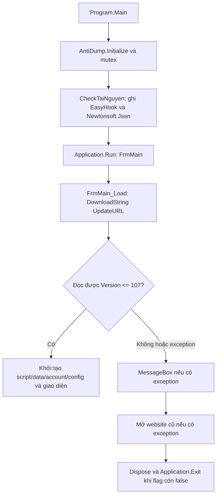

# ChickenAutoEx 107 — khôi phục mã và điều tra lỗi khởi động

Ngày điều tra: 09/10/2026 (Asia/Bangkok). Phương pháp: phân tích tĩnh trên Linux; không chạy ứng dụng, DLL native, bộ tự giải nén hay game.

## Kết luận

**Kiểm tra phiên bản qua dịch vụ cập nhật cũ là một điều kiện bắt buộc để hoàn tất khởi động.** Khi yêu cầu mạng đầu tiên thất bại, mã hiện `ex.Message`, mở `http://chickenauto.com/download`, rồi dispose form và gọi `Application.Exit()`. Đây là chuỗi hành vi khớp với báo cáo của người dùng. Một endpoint không truy cập được, redirect sang website bán tên miền, hoặc nội dung không có dòng `Version` hợp lệ đều có thể ngăn khởi động.

Đã khôi phục 331 file C#, project do decompiler tạo, tài nguyên WinForms dạng RESX, dữ liệu kỹ năng/bãi train và 213 định nghĩa script. Mã xử lý phụ bản có trong executable; không chỉ nằm trên máy chủ. Tuy nhiên, sự tồn tại của mã không chứng minh mọi tính năng được bật hoặc tương thích với server/game hiện tại.

**Chưa sửa ứng dụng và chưa xác nhận chạy được trên Windows 11.** Biên dịch kiểm tra C# thành công không phải kiểm thử ứng dụng hoàn chỉnh. Không xác định được nguyên nhân TLS/Schannel cụ thể của thông báo “unexpected error occurred on a send” chỉ từ phân tích tĩnh.

## 1. Phạm vi và nguồn binary

Checkout thực tế là `ttgpPsychMH/EAGLE-Auto`, nhánh ban đầu `work`, commit `a09b8c49f6d219ed0ab0c0cfb46f4bddf2c5de8d`. `git ls-remote` chỉ đọc cho `DevTLBB/AutoTLBB` trả về cùng HEAD tại thời điểm điều tra. Không đổi origin, không reset checkout và không sửa bản stable. Công việc được lưu trên nhánh `investigation/chickenautoex-107`.

| Tệp Ex trong repository | Kích thước | SHA-256 |
|---|---:|---|
| `ChickenAutoEx-new.exe` | 3,314,330 | `68eefa4fa4f172308431c5903a832d00968c22d288ec1d582f0d5a4444fd9d44` |
| `ChickenAutoEx-new.zip` | 901,230 | `a47292454434a00ed0d065effa7e6f5b145a269013414e214c55a2dc3b67641a` |
| `ChickenAutoEx-new.7z` | 873,956 | `f966db7933e7b64dafa63ef85d8dc9c6220e3e6f4e6fe5e7cfb0f68ac9787a02` |
| `ChickenAutoEx.exe` bên trong cả ba gói | 2,913,280 | `11c98b8eff545fbafa5fd6e9d3d281af62aa7fac4234eb546fcc2a4d671df573` |

`ChickenAutoEx-new.exe` là wrapper native PE32+ x64, GUI subsystem. Overlay 7z bắt đầu ở byte **400896** và chỉ chứa `ChickenAutoEx.exe`. Payload của wrapper, ZIP và 7z giống nhau từng byte. Vì vậy phải decompile payload, không decompile wrapper như một assembly .NET.

Tên phiên bản sản phẩm là **107**, lấy từ `Global.Version` và `PatchInfoEx.ini`. Assembly/file version vẫn là `1.0.0.0`; không dùng assembly version để phân biệt release 107.

Danh mục machine-readable, SHA-256 của cả sáu binary stable/Ex và tài nguyên: [inventory.json](evidence/inventory.json). Bản gốc được giữ nguyên trong repository; binary giải nén và công cụ nằm ngoài checkout tại `/workspace/chickenauto-investigation` và không được commit.

## 2. Runtime, kiến trúc và phụ thuộc

Payload là PE32 x86 (`Machine=0x14c`), Windows GUI, CLR metadata `v2.0.50727`, CorFlags `0x3` = ILONLY + 32BITREQUIRED. Nó dùng **.NET Framework 3.5 / CLR 2.0**, không phải .NET Core/.NET 8 và không phải ứng dụng x64. Windows x64 phải chạy qua WoW64. Framework 3.5 là Windows feature cần có khi chạy bản gốc; .NET 4.x không tự thay thế CLR 2.0 trong cấu hình này.

Entry point: MethodDef token `0x06000eb6`, `TinhKiemAuto.Program.Main`. Module MVID: `47af2eb6-e4fd-4067-9165-831dd37513ed`. Metadata có 446 TypeDef (bao gồm kiểu lồng nhau/compiler-generated) và 4,580 MethodDef. Các namespace chính: `TinhKiemAuto`, `.Models`, `.Controllers`, `.AutoControl`, `.Properties`; có code gộp của ProtoBuf và ComponentAce zlib. Một số tên vẫn là `Class95`, `U1` hoặc tên sinh bởi compiler, nên không thể khôi phục ý nghĩa/tên gốc của tất cả symbol.

| Phụ thuộc | Bằng chứng và trạng thái |
|---|---|
| `mscorlib`, `System`, `System.Windows.Forms`, `System.Drawing`, `System.Xml`, `System.Management` | AssemblyRef `2.0.0.0`; do .NET Framework cung cấp. WinForms/WMI/Win32 làm cho runtime phụ thuộc Windows. |
| `System.Core` | AssemblyRef `3.5.0.0`; xác nhận mức Framework 3.5. |
| `Newtonsoft.Json` | Executable tham chiếu strong-name assembly **12.0.0.0**. DLL nhúng thực tế lại có assembly version **10.0.0.0**, 494,592 byte; SHA-256 `c2386d0f4992c6bc97e93882ff57875e7ad3d1597d2fb68e05bad060b9f76894`. Không có app.config/binding redirect trong các gói Ex đã kiểm tra. Có nguy cơ lỗi binding khi đi sâu hơn vào chức năng JSON; chưa chứng minh lỗi runtime này xảy ra. |
| `Bin/EasyHook.dll` | Resource 202,240 byte; SHA-256 `1017f117193687302d3817d66cb9e7914c026d78aced4a02517a5c940efe5d79`. **DLL native x86**, export `GetMSG`, `SetHook`, `UnHook`, import KERNEL32/USER32/WS2_32. Không phải assembly managed EasyHook tiêu chuẩn chỉ vì trùng tên. Không khôi phục được mã C# của DLL native này. |
| `Zen.Barcode.Core` | AssemblyRef **3.1.0.0**, public-key token `b5ae55aa76d2d9de`; được dùng trong `ThongQR_Load`. Không có trong archive hoặc tài nguyên executable. Dùng package NuGet `Zen.Barcode.Rendering.Framework 3.1.10729.1`, có DLL đúng danh tính, để phân giải kiểu cho decompiler/compiler. Đây là phụ thuộc thiếu trong bản phân phối đã kiểm tra. |
| `AutoUpdate.exe` | Có đường dẫn trong `FrmMain.GetUpdate()`, nhưng không có trong gói. Không tìm thấy caller của phương thức đó trong assembly; không phải luồng cập nhật đang chạy lúc khởi động. |
| Windows/game/server | Các API Win32, layout bộ nhớ, dữ liệu map/NPC và Lua của game còn là phụ thuộc runtime. Không có source game hay server để kiểm chứng tính tương thích. |

Không có Authenticode certificate directory trong payload. Hash nhận diện tệp, không phải bằng chứng rằng binary đáng tin cậy để thực thi.

## 3. Khôi phục source và kiểm tra biên dịch

Công cụ: ILSpyCmd **9.1.0.7988** (open source), host .NET SDK **8.0.425**, Python 3.12 với `dnfile 0.18.0`, `pefile 2024.8.26`, `py7zr 1.1.3`. SDK 8 chỉ chạy công cụ phân tích; target vẫn là Framework 3.5 x86.

Lần decompile đầu thiếu reference assemblies Windows nên có cảnh báo `Unknown result type`. Sau khi bổ sung `Microsoft.NETFramework.ReferenceAssemblies.net35 1.0.3`, Newtonsoft.Json **12.0.3** (`lib/net35`) và Zen.Barcode nêu trên, cảnh báo phân giải kiểu được loại bỏ. Không thay đổi DLL nằm trong binary gốc để đạt kết quả này.

Tùy chọn ngôn ngữ mặc định C# 12 tạo một lỗi scope `CS0136` ở `FrmMain.cs` do tên `enumerator` trùng trong using declaration. Chạy lại **decompiler với `-lv CSharp7_3`** khôi phục dạng scope tương thích và biên dịch tĩnh thành công, không cần sửa logic nguồn.

Kiểm tra dùng Roslyn `csc.dll`, `/nostdlib+`, `/target:winexe`, `/unsafe+`, references Framework 3.5 và hai DLL có đúng danh tính AssemblyRef. Kết quả: **0 lỗi, 50 cảnh báo source** về biến/field/event không dùng hoặc chưa gán. Log thử đầu còn một cảnh báo dòng lệnh CS2023; lần kiểm tra snapshot cuối dùng `/noconfig` bên ngoài response file. Chỉ kiểm tra C#; không đóng gói RESX, DLL nhúng, icon và data thành một ứng dụng hoàn chỉnh, và không chạy output. [compiler log](evidence/source-compile.log)

Bản review tại [recovered](recovered) gồm toàn bộ 331 file C#, 16 RESX và tài nguyên văn bản. [recovery-manifest.json](recovery-manifest.json) liệt kê từng file, hash nguồn decompiled/hash snapshot, vị trí che dữ liệu và binary resource bị loại khỏi Git. Hai resource 180 byte `AlarmVaoPhai.resources` và `ShutDown.resources` có 0 entry, không được ILSpy xuất thành RESX; inventory giữ hash/kích thước bản gốc để theo dõi. Project `.csproj` là project **do ILSpy sinh**, không phải project gốc; các HintPath phản ánh thư mục reference của lần phân tích và cần được thiết lập lại khi chuẩn bị một build riêng. Các asset binary được loại khỏi snapshot có thể trích lại từ bản gốc bằng công cụ khôi phục; không tải hoặc chạy chúng trong quá trình review.

Đã che năm vị trí C# chứa tổng cộng sáu literal: key API bên thứ ba, mật khẩu mã hóa cấu hình (hai chỗ), prefix sinh key và cặp encrypted payload/password nhúng. Một key giải mã đồng thời là symbol Lua, xuất hiện thêm ba lần trong tài nguyên `ImageResource.resx`; các lần xuất hiện ấy cũng được che. Snapshot C# có chú thích `analysis redaction`. Không nhập mật khẩu game hay gọi API có key. Việc che chỉ áp dụng bản sao dùng review; không thay binary hay thay luồng xác thực. Tài nguyên Lua đã che và source này phục vụ phân tích, không phải bản deploy. Bản raw ngoài checkout vẫn là dữ liệu nhạy cảm và không được đưa vào Git.

Không thể khôi phục nguyên trạng comment, tên local variable, cấu trúc solution/project/build gốc, PDB hay lịch sử source. PDB được nhắc trong binary nhưng không có trong repository/gói. ILSpy gộp designer code vào class thay vì tái tạo chính xác các file `.Designer.cs`. `AntiDump.Initialize()` có logic sửa header trong bộ nhớ khi ứng dụng chạy; phân tích trên file vẫn thành công, không patch hoặc chạy routine này.

## 4. Luồng khởi động và lỗi mạng

Bằng chứng C#: [Program.cs](recovered/TinhKiemAuto/Program.cs), [Global.cs](recovered/TinhKiemAuto/Global.cs), [FrmMain.cs](recovered/TinhKiemAuto/FrmMain.cs). Bằng chứng IL trực tiếp cho các method: [startup.il](evidence/startup.il).

`Program.CheckTaiNguyen()` ghi resource `TinhKiemAuto.EasyHook.dll` vào `Bin/EasyHook.dll` và `TinhKiemAuto.Newtonsoft.Json.dll` vào cạnh executable **trước** `Application.Run`. Do đó quan sát hai DLL xuất hiện phù hợp với chương trình đã vào Main; thiếu CLR hoàn toàn không phải cách giải thích tốt cho chính lần chạy này.

`FrmMain` constructor chạy `InitializeComponent()` và đăng ký handler Load. Trong `FrmMain_Load`:

1. `flag = false`; `WebClient.DownloadString(Global.UpdateURL)` chạy đồng bộ trên UI thread.
2. `Global.UpdateURL` chỉ là `http://update.chickenauto.com/PatchInfoEx.ini`; không có fallback GitHub hoặc đọc `PatchInfoEx.ini` local trong luồng này.
3. Parser chia dòng theo CR/LF, chia theo `=`, tìm khóa `Version`, gọi `int.Parse`. Phiên bản lớn hơn 107 ném `Version too low`; phiên bản bằng hoặc thấp hơn đặt `flag = true`. Giá trị không phải số ném exception.
4. `catch (Exception ex)` gọi `MessageBox.Show(ex.Message)` rồi `Process.Start("http://chickenauto.com/download")`.
5. Nếu `flag` vẫn false: `Dispose()`, `Application.Exit()`, `return`; các bước khởi tạo script/data/account nằm sau đây không được thực hiện.

Nuance: parser không reset `flag` nếu một dòng phiên bản hợp lệ đã xuất hiện trước lỗi ở dòng sau. Website HTML không có dòng Version thì thoát nhưng có thể **không** hiện MessageBox; browser chỉ được mở trong catch. Bản metadata GitHub đơn giản có đúng một dòng `Version = 107`, phù hợp với nhánh cho phép khởi động, nhưng executable không dùng URL GitHub ấy.

Các mạng khác: `Poster` có GET/POST helper, `FormUpload` và `TINHKIEM.HttpUploadFile` có POST multipart, `Downloader` có code tải file; `SocketClient` có socket/nhận AutoReport. Đây không phải bằng chứng rằng mọi helper đều được gọi lúc startup. `Debug` có mã gọi dịch vụ captcha bên thứ ba; không thực thi hoặc gửi dữ liệu/key tới dịch vụ. Các model `LoginResponse`, `CheckUpdateRequest/Response`, `ScriptRequest/Reponse` không chứng minh dịch vụ server tương ứng còn hoạt động.

`Poster.DisableValidate()` có callback bỏ qua chứng chỉ TLS trong source gốc. Không tìm thấy caller trong IL của assembly; startup dùng `WebClient` trực tiếp và không gọi helper đó. Không sử dụng callback này trong điều tra và không đề xuất dùng nó làm cách sửa.

## 5. Dịch vụ cập nhật có chịu trách nhiệm không?

**Có, ở mức luồng điều khiển:** lỗi hoặc nội dung không hợp lệ từ update service ngăn hoàn tất startup trong binary 107. Chuỗi exception → MessageBox → browser cũ → exit chính xác đã được khôi phục và đối chiếu IL. Đây là kết luận mạnh về một lỗi thiết kế/phụ thuộc startup, chưa phải tái hiện đầy đủ trên Windows.

**Nguyên nhân transport cụ thể chưa được xác minh.** URL ban đầu dùng HTTP; `WebClient` theo redirect mặc định. Nếu domain đã chuyển sang HTTPS/parking, CLR 2.0 và cấu hình TLS/Schannel có thể không thương lượng được với endpoint đích. Thông báo send error cũng có thể do proxy/reset/transport khác; cần `WebException.Status`, toàn bộ inner exception và redirect chain trên Windows để phân biệt. Không tìm thấy cấu hình `SecurityProtocol` trong source ứng dụng. Chỉ bật TLS mới không giải quyết được một website bán tên miền trả HTML.

| Kiểm tra chỉ đọc, 09/10/2026 | Kết quả | Giới hạn |
|---|---|---|
| HEAD HTTP endpoint update cũ | 403, `server: envoy` trong môi trường cloud | Đây là phản hồi đường mạng/proxy; không đủ để xác nhận server gốc hay redirect HugeDomains. Không thay network policy để lách giới hạn này. |
| GET metadata raw GitHub upstream | HTTP 200; 14 byte, đúng `Version = 107`, giống file checkout | Xác nhận metadata GitHub còn đọc được bằng client hiện đại, không chứng minh CLR 2.0 trên Windows thương lượng HTTPS được. |
| Git HEAD upstream | Cùng SHA với checkout | Không chứng minh ownership hoặc trạng thái của update domain. |
| HugeDomains redirect | Người dùng quan sát | Chưa tái xác minh độc lập từ cloud. |
| Stable 116 còn chạy | Người dùng quan sát | Không chạy hoặc decompile bản stable để suy đoán nguyên nhân khác biệt. |

Kết quả network chi tiết: [network-observations.json](evidence/network-observations.json). Không quy kết đây là lỗi độc quyền của Windows 11; bất kỳ Windows nào dùng luồng này cũng có thể thoát nếu metadata không hợp lệ/không tải được.

## 6. Module phụ bản nằm ở đâu?

Không chỉ có danh sách map/NPC: `Game.cs` có method với thân xử lý điều kiện map, vị trí, quái/boss, dialog và trạng thái nhóm. Vòng xử lý game gọi các method điều phối bên dưới. Điều này đủ chứng minh có implementation phía client, không chứng minh hoạt động thực tế trên một server.

| Chức năng/code | Bằng chứng trong source khôi phục |
|---|---|
| Nhận diện map phụ bản | `Game.IsMapPhuBan()`, `MAP.IsPhuBan(...)`; các map Ác Bá, Tặc Khấu, Tàng Kinh Các, Viêm Ma Sơn, Tam Tài Hiệp Cốc, Kỳ Cuộc, Bảo Tàng, Phiêu Miểu Phong… |
| Ác Bá / Ác Tặc | `Game.DatDoiAcBa()`, `DatDoiAcTac()`, `TalkNPCPhuBan()` và các branch map/NPC trong `P()` |
| Trân Long Kỳ Cuộc | `DatDoiKyCuoc()`, `TRANLONGKYCUOC.cs`; nhánh phát hiện boss chết, chờ thời gian và đi tới NPC trong loop |
| Lâu Lan Tam Bảo / Q123 | `DatDoiLauLanTamBao()`, `DatDoiQ123LauLan()`, `IsQ123ToChau`, map/state transition trong `P()` |
| Thủy Lao | `DatDoiThuyLao()` và NPC/dialog/state branch |
| Tàng Kinh Các | `DatDoiTKC()`, `TKC()`; có kiểm tra `Global.IsVIP` và `Game.IsTKC` trả false trong binary này |
| Yến Tử Ổ / Phượng Hoàng | `YENTUO.cs`, `PHUNGHOANGCOTHANH.cs`, `Game` có nhánh theo map/vị trí và cờ liên quan; mức độ hoàn chỉnh cần Windows/game test |
| Kỹ năng, path, nhiệm vụ | Resource JSON/text/map, `FindPath`, `Scripts.Load`, `Script.cs`, XML nhúng có 213 definition; không tải script server để khôi phục chúng |

`Global.IsVIP` được đọc ở một số module; không tìm thấy caller `set_IsVIP` trong IL. Không gán VIP, không đổi `IsTKC`, không sửa HWID, keygen, login hay quyền máy chủ. Có code tồn tại nhưng bị gate/tắt là giới hạn của build cần được giữ nguyên và xác minh hợp lệ ở nhiệm vụ sau.

## 7. Chiến lược sửa đề xuất — chưa triển khai

1. **Dựng baseline có thể tái lập:** trên Windows, dùng compiler hiện đại với reference assemblies Framework 3.5 hoặc một nhánh port Framework 4.8 riêng. Khôi phục đầy đủ assets/resources; xác định binding Newtonsoft đúng bằng assembly identity, không ghi đè ngẫu nhiên DLL. Đưa Zen.Barcode đúng phiên bản vào gói hoặc xác nhận chỉ optional ở màn QR. DLL native EasyHook cần giữ nguyên cho baseline và đánh giá riêng; không thay bằng package trùng tên.
2. **Sửa phụ thuộc cập nhật:** chuyển metadata sang HTTPS endpoint do chủ dự án kiểm soát. Có timeout, parse/schema/version validation, giới hạn redirect và chẩn đoán lỗi. Không mặc nhiên chuyển mọi URL cùng domain vì có thể liên quan chức năng khác. Đề xuất update check không chặn khởi động khi offline nếu không có yêu cầu xác thực riêng; phân tách trạng thái “không kiểm tra được” với “phiên bản mới”. Không gỡ điều kiện licensing/authentication/VIP để làm UI chạy.
3. **Bảo vệ luồng lỗi:** đưa request ra khỏi UI thread, log status/inner exception không chứa tài khoản/token, không tự mở domain đã mất quyền kiểm soát; xử lý lỗi `Process.Start` riêng. Giữ TLS/certificate validation chuẩn. Cấu hình TLS hoặc port runtime chỉ sau khi có Windows transport evidence.
4. **Kiểm thử Windows có kiểm soát:** với bản build đã review, không chạy binary gốc chưa tin cậy; kiểm tra UI startup trong máy Windows 11 cô lập, chưa attach game. Ma trận metadata: 107, mới hơn, timeout/offline, HTML parking, thiếu Version, malformed version, TLS/certificate failure và browser-launch failure. Kiểm tra resource extraction/binding/x86 và không có request tới API bên thứ ba. Sau đó mới kiểm tra module với game/server thử nghiệm được cho phép và giữ nguyên xác thực/quyền truy cập.
5. **Đánh giá tương thích game riêng:** offsets, hook native, Lua/game version và quyền process có thể gây lỗi sau startup. Đây là phạm vi khác với endpoint cập nhật; phải có bằng chứng trước khi sửa. Không chỉnh bản stable 116.

## 8. Những gì đã và chưa được xác nhận

Đã xác nhận: ba gói Ex chứa payload giống nhau; binary gốc không đổi; parse PE/.NET/resources; khôi phục C#/RESX/data; đối chiếu IL luồng startup; biên dịch C# tĩnh; metadata GitHub còn hợp lệ. Script tái khôi phục và export snapshot đã được chạy trong môi trường này.

Chưa xác nhận: chạy WinForms/CLR 2.0 trên Windows 11, handshake của domain cũ trên máy người dùng, redirect HugeDomains độc lập, binding JSON lúc runtime, tương thích EasyHook/game/server và hiệu quả phụ bản. Không có source server, source native EasyHook, PDB, project gốc hoặc secret hợp lệ cho các API. Không thử dùng các hằng số credential tìm thấy.

Source review và project skeleton đã đủ để bắt đầu một nhiệm vụ sửa riêng sau khi xem báo cáo. **Không có functional repair, release binary mới hoặc tuyên bố đã sửa xong trong commit điều tra này.**
