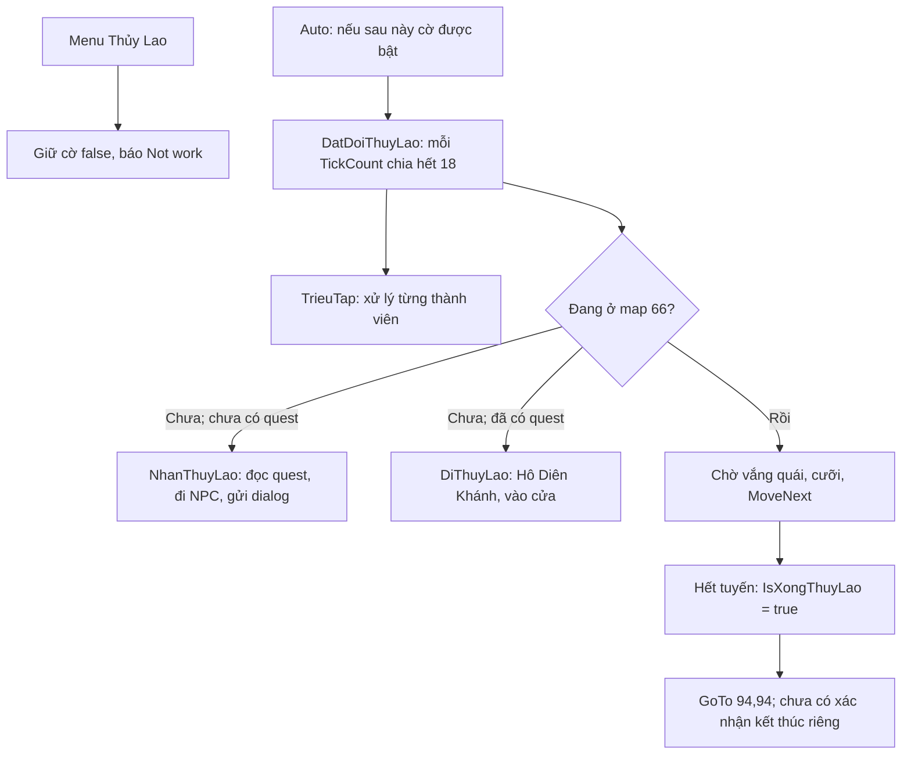

# Thủy Lao trong ChickenAutoEx 107 / EAGLE Auto: rà soát tĩnh

Ngày: 10-10-2026 (Asia/Bangkok). Baseline source: `c1b126b0b7ed3ddf5cc1e3930c177559c779d666`. Phạm vi lượt này: đổi tên/version build; **chỉ phân tích Thủy Lao, chưa sửa hoặc bật engine**.

## Kết luận

107 có code nhận nhiệm vụ, vào cửa, dẫn đội, tuần tra và một cờ hoàn thành cho Thủy Lao. Tuy nhiên menu chủ động đặt `IsThuyLao = false` rồi báo `Not work`. Không tìm thấy phép gán `IsThuyLao = true` trong source ứng dụng được build; cũng không có đường bật từ lịch trong `SetCalendar()`. Vì vậy các lỗi engine dưới đây phần lớn là lỗi tiềm ẩn nếu sau này triển khai việc bật lại, chưa phải lỗi đã tái hiện trong game của người dùng.

Không nên chỉ đổi menu để bật cờ. Có một lỗi map đích được đối chiếu cả IL gốc; nhánh phối hợp đội có thể ra lệnh cho thành viên đã tắt Auto; việc đi hết tuyến bị coi là hoàn thành mà không kiểm tra nhiệm vụ. Luồng nhận/vào/thoát còn thiếu xác nhận và timeout. Chưa đủ bằng chứng để nói Thủy Lao hoạt động đầy đủ trên client private hiện tại.

## Code và dữ liệu đã kiểm tra

Các số dòng trỏ tới snapshot khôi phục trong `analysis/chickenautoex-107/recovered/`, riêng menu trỏ tới `src/ChickenAutoEx/FrmMain.cs`. [Evidence](evidence/source-inventory.json) lưu hash, vị trí và các dòng tham chiếu của toàn bộ bốn biến trạng thái.

| Nhóm | Vị trí |
|---|---|
| Menu, lấy leader, reset và dấu tick | `FrmMain.cs:4101–4303`; `ItemThuyLao_Click:4295`, designer `5205` |
| Bốn biến trạng thái | `Game.cs:450,873,1238,1590`: `TrangThaiThuyLao`, `IsThuyLao`, `DaNhanThuyLao`, `IsXongThuyLao` |
| Nhận / vào / dẫn | `Game.cs:4562` `DiThuyLao`; `4595` `NhanThuyLao`; `4664` `DatDoiThuyLao` |
| Tổ đội / điều khiển thành viên | `Game.cs:1727` `Party`, `1750` `Leader`, `4819` `TrieuTap` |
| Loop, đọc metadata, reset map, lịch | `FrmMain.cs:1161` `Auto`; `Game.cs:5517` `Auto`, `5502` `ClearMission`, `6069` `SetCalendar`, `3330` `IsMapPhuBan` |
| Di chuyển / tuần tra / kết thúc | `Game.cs:2198–2315` `GoTo/TimDuong`, `8558` `MoveNext()`, `8813` `MoveNext(int[,])`, `8862` `Next(int[,])` |
| Đọc quest và dialog, gửi thao tác | `Task.cs:29,136` `ClearName/Enum`; `TaskInfo.cs`; `TLBB.cs:395` `IsTogleMission`; `LUA.cs:95` `OpenWindowMissionTrack`; `Game.cs:1929,8491,8496,9679,9706` |
| NPC / map / route / script | `THAIHO.cs:5–15`; `TOCHAU.cs:5,16–24`; `MAP.cs:9,21,159`; `PathList.txt:25,65`; `Scripts.xml:81`; `Scripts.cs` loader `20.dat`; `GameObjects.cs:85,101` quái trong bán kính |
| Cơ chế dùng chung ảnh hưởng | `PickItem`, cưỡi/ngừng theo, đánh quái/skill, `P()`, `IsClick`, `ClearTime`, offset trong `Address.cs` và read trong `TLBB/Memory` |

Không có class `THUYLAO.cs` riêng. Tuyến tuần tra được hardcode trong `Game.MoveNext()`. Dòng script có nhãn Thủy Lao là metadata nhận nhiệm vụ; không chứng minh một engine phụ bản hoàn chỉnh. Chỉ đọc native resource dưới dạng dữ liệu; chưa reverse-engineer giao thức hook bên trong DLL native.

`FrmMain.Auto` tăng tick theo bước 3; `18` tương ứng mỗi sáu vòng đủ điều kiện, không phải 18 giây. Loop có sleep và thời gian xử lý, nên khoảng gọi thực tế cần đo. Toàn bộ loop giữ điều kiện `Global.IsFull != 0`; trong engine vẫn giữ các nhánh VIP cũ của những module khác. Không có bằng chứng licensing/VIP là nguyên nhân Thủy Lao bị menu từ chối.

## Phát hiện và hướng cải thiện

**TL01 — Menu chưa cho phép chạy (đã xác nhận).** `ItemThuyLao_Click` luôn gán false, không khởi động nhận/vào cửa. Đây là hành vi gốc đã được giữ khi sửa null reference cho menu; không phải lỗi sinh ra từ việc đổi tên EAGLE. Cần giữ trạng thái chưa khả dụng cho tới khi luồng engine được kiểm thử. Test menu hiện có xác minh false và bỏ dấu tick, không xác minh đi phụ bản.

**TL02 — Map đích không khớp NPC (đã xác nhận trong source và IL).** `DiThuyLao:4566` gọi `TimDuong(THAIHO.HoDienKhanh.X, …Y, MAP.ToChau)`, trong khi NPC nằm ở `THAIHO.Id = 4`, map Tô Châu là `1`. Nếu nhân vật đang ở ngoài 1/4/66, lệnh đầu tìm đường về map 1 với tọa độ 67,77 của map 4. Sau đó `GoTo(NPC)` có map NPC nên có thể đi tiếp về map 4; chưa chứng minh sẽ kẹt vĩnh viễn. IL gốc `IL_004d` load `MAP::ToChau`, `IL_0052` gọi `TimDuong`, nên không phải do decompiler chọn nhầm tên. Đề xuất dùng map của NPC để tránh nhầm giữa các map; kiểm thử fake từ map 2, 1, 4 và 66 trước khi thay đổi thật.

**TL03 — Nhánh dẫn thành viên không kiểm tra Auto/online (thiếu guard đã xác nhận).** `TrieuTap:4828–4876` gọi trực tiếp `item.NhanThuyLao/DiThuyLao/UpRide/GoTo` mà không kiểm tra `item.IsAuto`, online hay scene transition. `Game.Auto` có guard `!IsAuto`, nhưng guard đó chỉ bảo vệ lời gọi Auto của chính nhân vật, không bảo vệ lệnh từ leader vào helper. Khi một thành viên cùng đội tắt Auto nhưng leader vẫn chạy, helper vẫn có thể gửi lệnh. Nhánh này cũng đi trước kiểm tra `KeyId == TLBB.Id` và trạng thái chết của nhánh triệu tập thông thường. Đề xuất kiểm tra quyền điều khiển từng thành viên và dữ liệu mới trước mọi lệnh, dừng tác động ngay khi họ tắt Auto hoặc đổi đội.

**TL04 — Người dẫn chưa được ràng buộc lại là leader (đã xác nhận thiếu guard; ảnh hưởng có điều kiện).** `Auto:5847` gọi `DatDoiThuyLao` trước `if (TLBB.IsLeader)`; method không tự kiểm tra leader. Menu hiện không bật cờ nên chưa gặp qua UI; nếu cờ bật rồi đổi trưởng đội, instance cũ có thể tiếp tục dẫn. `Party:1727` chỉ ghép theo `KeyId`, thêm self hai lần bằng hai `if`; trong trường hợp leader hợp lệ, self bị `TrieuTap` bỏ qua nên không kết luận tự chạy hai lần. Cần kiểm tra leader, danh tính đội hợp lệ và loại trùng trong snapshot trước mỗi bước; giữ luật licensing hiện có.

**TL05 — Đội không cùng map có thể đi ngược cửa (đã xác nhận điều kiện; cần mock/game xác định hậu quả).** `TrieuTap:4830` dùng `memberMap != 66 || leaderMap != 66`. Nếu member đã vào 66 nhưng leader còn ở map 4, code vẫn cho member đi nhánh nhận/vào lại; `DiThuyLao` ở 66 gọi `GoTo` NPC map 4. Chưa biết pathfinder/server có cho phép ra theo lệnh đó không. Nên phân loại từng trạng thái của member; thành viên đã vào cửa cần chờ leader vào, không bị điều về NPC.

**TL06 — Đi hết tuyến bị coi là đã xong (đã xác nhận).** Tuyến có 12 điểm; `MoveNext(int[,]):8835–8857` đặt `IsXongThuyLao = true` khi index vượt cuối tuyến, không đọc `Task.Completed`, số quái/boss hoặc trạng thái kết thúc server. Đi qua điểm cuối mà còn mục tiêu ở nơi khác vẫn đạt điều kiện này. Sau đó `DatDoiThuyLao:4673` chỉ tới 94,94 và return; không có nhánh Thủy Lao riêng xác nhận thoát/trả quest/chạy lượt mới. Điểm này có phải trigger tự kết thúc ở server private hay không chưa biết. Cần tách “hết tuyến” với “server xác nhận hoàn thành”, rồi xác nhận map/quest sau thoát.

**TL07 — Reset quest không reset đủ trạng thái (đã xác nhận).** `Auto:5537–5601` reset `DaNhanThuyLao/IsXongThuyLao/IsClick` trên scene transition, nhưng không reset `TrangThaiThuyLao`. Ví dụ chuyển map trong trạng thái `NhanThuyLao` thì lần sau có thể tiếp tục thao tác NPC mà không đọc lại quest. `ClearMission:5502` và lịch `SetCalendar` cũng không xóa `IsThuyLao`; `IsMapPhuBan` không gồm map 66 nên lịch có thể xem đây là map không bận và chọn module khác. Cần reset riêng theo vòng đời phụ bản/đổi đội/đổi scene, có chế độ độc quyền; chưa sửa helper dùng chung ở lượt này.

**TL08 — Nhận quest và dialog không có xác nhận/timeout (đã xác nhận thiết kế).** `NhanThuyLao` chuyển chuỗi `"" → OpenMission → CloseMission → NhanThuyLao` theo mỗi lần gọi, không chờ xác nhận thao tác mở/đóng. Điều kiện `!TLBB.IsTogleMission && !TLBB.IsTogleMission` bị lặp. `Task.Enum` lại tự mở cửa sổ mission qua LUA, nên đọc quest có side effect. Chỉ cần `ClearName.Contains("binhdinhthuylao")` để đánh dấu đã nhận; bỏ qua `Completed/Complete`, có thể nhầm quest đã hoàn thành đang chờ trả. `IsQuestOpen` không xác minh đúng NPC/dialog option; `IsClick` dùng chung với nhiều module. Nếu server từ chối nhận, hết lượt, mất NPC hoặc dialog đổi, code có thể lặp mãi mà không nêu lý do. Đề xuất state có tên rõ ràng, chỉ tiến khi quan sát trạng thái mới, timeout/retry hữu hạn, phân biệt chưa nhận/đang làm/chờ trả/từ chối. Không sử dụng các setter ghi trạng thái quest vào memory để giả hoàn thành.

**TL09 — Combat và thời gian chờ dựa vào dữ liệu cục bộ (rủi ro cần client evidence).** Leader dùng bán kính 15, member 20, loop chung reset `ClearTime` khi thấy quái trong 12; timer khởi tạo ngay từ constructor và được nhiều module khác dùng. Sau 2 giây không reset, leader cưỡi hoặc đi tiếp, không có timeout chờ đủ đội hay xác nhận trận đánh đã kết thúc. Quái chưa spawn/chưa được đọc không có nghĩa đã dọn xong. `MoveIndex` cũng là biến dùng chung. Nên dùng timer/index riêng, ưu tiên combat, theo dõi thành viên và mục tiêu, ghi lý do chờ/di chuyển. Chưa kết luận các bán kính/tọa độ sai trên client này.

**TL10 — Thông số client được hardcode, chưa có baseline private (giới hạn).** Map 66, NPC ID 93/13, dialog 232000/232002, tọa độ và offsets thuộc baseline gốc. `Talk(NPC)` gửi trực tiếp ID; không tìm lại NPC runtime như overload theo tên. Script XML chỉ ghi Hô Diên Báo ở 342,311 trong khi class ghi 339,310; chênh lệch chưa chứng minh lỗi vì có thể là điểm đứng để nói chuyện. Cần ghi nhận bằng thao tác tay và ảnh/dialog/map/quest của client thực tế; chưa đổi offsets hoặc thay protocol hook theo suy đoán.

**TL11 — Exception bị nuốt và tiến trình nhận quest khó quan sát (đã xác nhận).** `FrmMain.Auto:1200–1217` có `catch` rỗng quanh từng nhân vật. Một lỗi read/đội/NPC có thể bị lặp lại mà không hiện thông báo. Đề xuất log giới hạn tần suất với mã bước/map/trạng thái/loại exception, không account/password/token, không dump memory; lỗi lặp cần dừng module và hiển thị nguyên nhân.

**TL12 — Helper chọn điểm gần nhất có lỗi dùng chung (xác nhận source; không coi là lỗi trực tiếp của tuyến map 66).** `MoveNext(int[,]):8826` truyền `point[i,0]` làm cả X và Y khi tìm điểm gần nhất. `Next(int[,]):8869` cũng vậy và không cập nhật biến khoảng cách nhỏ nhất. Map 66 thường khởi tạo `MoveIndex = 0`, bỏ nhánh tìm gần nhất, nên chưa chứng minh TL12 gây lỗi trong lượt Thủy Lao. Ghi lại để xử lý riêng với test hồi quy các map khác, không sửa helper chung trong đợt chỉ rà Thủy Lao.

## Kiểm thử và bước tiếp theo

Đã đọc source, dữ liệu, caller và các setter; đối chiếu ba method Thủy Lao với IL trích từ đúng EXE trong `ChickenAutoEx-new.zip` bằng ILSpy. **Không chạy EXE/DLL game automation, không dùng tài khoản game, không gửi lệnh game, chưa có test engine Thủy Lao bằng mock hoặc Windows.** 94 test sẵn có kiểm tra updater, UI/settings và menu; không được dùng số đó để khẳng định logic TL02–12 đã chạy đúng. Việc đổi tên build có probe version 0.2 riêng; không thay automation.

Ưu tiên đợt sau:

1. Tạo bộ mô phỏng Thủy Lao tách hoàn toàn khỏi hook/game: snapshot nhân vật/đội/quest/dialog/map, clock giả và danh sách lệnh dự kiến. Đặt case cho Auto OFF, đổi leader, member vào trước, map chuyển giữa bước, quest đã completed, từ chối entry, sai NPC, còn quái sau điểm cuối, mất kết nối và stuck.
2. Sửa các lỗi hẹp TL02–05, rồi state/reset/confirmation TL06–08 bằng kết quả mock. Tiếp tục giữ menu chưa khả dụng trong giai đoạn này; chưa thay shared combat/movement/VIP hoặc mở khóa điều kiện truy cập.
3. Thu một lượt đi Thủy Lao bằng tay trên đúng private client: mapID trước/sau, NPC/dialog, tên/trạng thái quest, số thành viên và cách kết thúc. Che thông tin tài khoản. Không cần cung cấp credential hoặc thực hiện bypass.
4. Sau khi mock qua và baseline client đủ, thử Windows 11 có giám sát: từng bước nhận quest → entry → một chặng → kết thúc; ưu tiên khả năng dừng ngay. Khi đó mới cân nhắc bật menu trên nhánh riêng và nâng version sản phẩm, không tuyên bố phụ bản đã sửa chỉ vì app mở được.

Cải thiện bản 107 theo chức năng thường 116 vẫn tiếp tục theo [baseline so sánh](../chickenauto-116-vs-107/REGULAR-FEATURES.vi.md); Thủy Lao nên là một hạng mục riêng, tránh sửa đồng thời offset, combat và giao diện khiến khó xác định lỗi.
