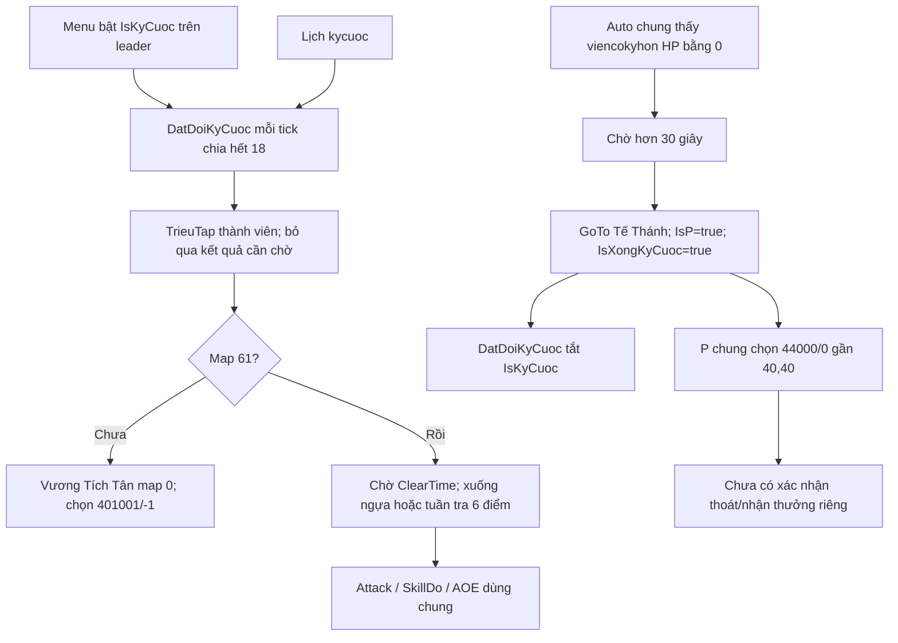

# Trân Long Kỳ Cuộc: rà soát source ChickenAutoEx 107 / EAGLE Auto v0.2

Ngày: 10-10-2026 (Asia/Bangkok). Baseline: commit `6d83466`, sau các sửa hẹp Thủy Lao. Nhánh báo cáo: `analysis/eagle-auto-tran-long-ky-cuoc`.

**Chỉ phân tích, chưa sửa automation, chưa tăng version, chưa tạo bản EXE mới.** Binary gốc, stable 116, cơ chế quyền sử dụng của auto gốc và các sửa Thủy Lao được giữ nguyên.

## Kết luận

107 có engine Trân Long Kỳ Cuộc thực sự: bật từ menu hoặc lịch, dẫn trưởng đội đến NPC, chọn vào cửa, tuần tra sáu điểm, dùng combat chung, nhận diện boss chết, chờ rồi đi đến Tế Thánh và chọn dialog kết thúc. Tuy nhiên luồng hiện tại chưa kiểm soát tốt vòng đời một lượt và chưa xác nhận hoàn thành trên server.

Ba vấn đề nên ưu tiên là **cờ hoàn thành không reset**, **nhánh kết thúc vẫn có thể ra lệnh khi menu Kỳ Cuộc đã tắt**, và **lệnh của leader có thể tác động thành viên đã tắt Auto**. Có thêm lỗi dùng skill pet truy cập danh sách quái rỗng trong helper chung. Đối chiếu IL xác nhận một số lỗi là hành vi binary gốc, không phải do decompiler hay đổi tên EAGLE.

Chưa đủ dữ liệu để kết luận map/NPC/dialog của client private hiện tại giống bản gốc. Chưa kiểm thử engine Kỳ Cuộc bằng mô phỏng hoặc trong game; không nên dùng kết quả test menu hay app mở được để coi phụ bản đã hoạt động.

## Phạm vi và bằng chứng

Số dòng `Game.cs` dưới đây trỏ tới snapshot khôi phục bất biến tại [Game.cs](../chickenautoex-107/recovered/TinhKiemAuto/Game.cs). Source thực tế được build là Game khôi phục có các thay đổi Thủy Lao theo allowlist. Đã áp dụng và đảo ngược allowlist để so sánh: `DatDoiKyCuoc`, `P`, `AOE`, `Attack`, `FollowKey`, `DatDoiTKC` và `MoveNext()` vẫn giống snapshot. `TrieuTap`, `Auto`, `ClearMission` và `MoveNext(int[,])` có sửa Thủy Lao, nhưng các nhánh Kỳ Cuộc được phân tích ở đây còn nguyên. Menu dùng [FrmMain.cs hiện tại](../../src/ChickenAutoEx/FrmMain.cs).

[Inventory](evidence/source-inventory.json) lưu hash file, tất cả tham chiếu các cờ trong những file khảo sát, hash các method và kiểm tra mẫu source. [Collector](tools/collect_evidence.py) có thể chạy lại, không nạp hoặc chạy assembly automation.

| Nhóm đã rà soát | Vị trí và ý nghĩa |
|---|---|
| Menu/context/reset | `FrmMain.cs:4123–4293`: tìm nhân vật/leader, cập nhật tick, bật/tắt, reset module |
| Trạng thái và danh sách đội | `Game.cs:438,448,1094,1222,1280,1282,1304,1306,1727,1750`: timer, cờ, Party/Leader |
| Engine chính | `Game.cs:4715–4780`: `DatDoiKyCuoc()` |
| Điều khiển thành viên | `Game.cs:4819–4936`: `TrieuTap()`; build hiện tại chỉ thay nhánh Thủy Lao |
| NPC kết thúc | `Game.cs:4968–5451`, riêng `5106–5124`: `P()` và dialog `44000/0` |
| Loop/reset/phát hiện boss | `Game.cs:5517–5605,5709–5767,5825–5862,5938–6014`: đọc metadata, scene reset, boss, caller và combat |
| Lịch | `Game.cs:5502,6069–6145`: `ClearMission`, `SetCalendar`; đường bật `kycuoc` |
| Tuyến/di chuyển/follow | `Game.cs:2198–2313,2998–3018,6888,7506,8558,8589,8813,8862,10101`: GoTo, Follow, Move, MoveNext |
| Combat | `Game.cs:774–788,6811–6885,7685,7710,9614`: IsLureEx, Attack/GetBestTarget, SkillDo, AOE |
| NPC/map | `LACDUONG.cs:5,VuongTichTan`; `TRANLONGKYCUOC.cs:5–13`; `MAP.cs:149`: map 0/61, Vương Tích Tân/Tế Thánh |
| Đọc đối tượng/dialog/quest | `GameObjects.cs`, `GameObject.cs`, `TLBB.cs`, `QuestFrame.cs`, `Task.cs`, `TaskInfo.cs`, `Address.cs`, `Memory.cs` |
| Dữ liệu/script/path | `Scripts.xml:69`, `Scripts.cs`, `Script.cs`, `FindPath.cs`, `Unity.cs`, `PathList.txt`, `Screen.txt`, LUA trong `ImageResource.resx` |
| Loop ngoài và lỗi | `FrmMain.cs:1161–1224`: điều kiện quyền sử dụng, tăng tick, các catch rỗng |

**Phân biệt tên:** `DatDoiKyCuoc` + `IsKyCuoc` + map 61 là Trân Long Kỳ Cuộc. `DatDoiTKC`, `MapTKC`, `TKCINFO`, `TKCComplete` và `RandomTKC` là **Tàng Kinh Các**, có map `MAP.TangKinhCac` và các đợt 1/10…10/10. Không lấy code Tàng Kinh Các làm engine bàn cờ. `Game.TKC()` là method rỗng, không phải bằng chứng menu Kỳ Cuộc thiếu implementation.

`DatDoiKyCuoc` không có guard VIP trực tiếp. Caller có guard leader; vòng lặp ngoài vẫn có `Global.IsFull != 0`. Nhánh VIP cho Lâu Lan và `DatDoiTKC` thuộc các luồng khác. Báo cáo này không đề xuất thay điều kiện quyền sử dụng nào.



Nhánh boss và `P()` nằm trong Auto chung, chạy trên từng instance nhân vật, không phải chỉ trong `DatDoiKyCuoc`. `TickCount` tăng theo bước 3; chia hết 18 là mỗi sáu vòng, **không phải 18 giây**.

## Phát hiện và hướng cải thiện

### KC01 — Cờ hoàn thành không được reset cho lượt tiếp theo — ưu tiên cao, xác nhận source/IL

`IsXongKyCuoc` chỉ có một phép gán `true` ở `Auto:5760`, không có phép gán `false` trong source khảo sát. Menu chỉ toggle `IsKyCuoc`; scene reset, `ClearMission`, reset menu và tắt/bật Auto không xóa cờ hoàn thành này. `DatDoiKyCuoc:4717` kiểm tra cờ hoàn thành trước cả kiểm tra bật module và lập tức đặt `IsKyCuoc = false`.

Sau khi một instance đạt trạng thái xong, bật lại menu/lịch trên cùng instance sẽ bị method tắt lại, kể cả đã ra map khác. Khởi tạo instance mới có thể làm cờ trở lại mặc định; không coi đó là cách sửa. IL toàn bộ binary chỉ có một lời gọi setter hoàn thành, tại `Auto::IL_07bc`, giá trị truyền là 1.

Đề xuất session Kỳ Cuộc riêng, reset có chủ đích khi bắt đầu lượt mới/đổi nhân vật/đội/leader; phân biệt ra map sau hoàn thành với mất map giữa lượt để tránh vô tình khởi động lại.

### KC02 — Tắt menu chưa hủy được luồng kết thúc — ưu tiên cao, xác nhận điều kiện trong code

`Auto:5754` chỉ kiểm tra map 61 và `IsBossDie`; không kiểm tra `IsKyCuoc`. Sau hơn 30 giây, nhánh tiếp tục `GoTo(Tế Thánh)`, bật `IsP`, đánh dấu hoàn thành, dù menu đang OFF. Guard `!IsAuto` ở đầu Auto vẫn tồn tại: đây là vấn đề **tắt riêng menu Kỳ Cuộc trong khi Auto chung đang ON**, không phải kết luận toàn bộ Auto OFF vẫn tự chạy trên chính nhân vật.

Ảnh hưởng còn có thể xuất hiện khi người dùng đi Kỳ Cuộc bằng tay, dùng Auto cho combat thường và chưa từng bật menu: boss detector chung vẫn nhận `viencokyhon`. Cần giới hạn các hành động kết thúc vào session Kỳ Cuộc hợp lệ, có hủy thao tác đang chờ và chỉ xóa trạng thái do module này sở hữu. Không sửa tùy tiện `IsP` của module khác.

### KC03 — Đánh dấu hoàn thành trước xác nhận tới NPC và kết thúc — ưu tiên cao, xác nhận source/IL

`Auto:5758` bỏ qua kết quả bool của `GoTo(TeThanh)`, rồi luôn đặt `IsXongKyCuoc = true`. IL `IL_07ad` gọi GoTo, `IL_07b2: pop`, sau đó setter hoàn thành. Cờ này vì vậy có nghĩa gần với “đã bắt đầu bước kết thúc”, chưa chứng minh đã tới NPC, chọn đúng dialog, nhận thưởng hay đổi map.

Không kết luận module sẽ chỉ đi một lần rồi kẹt: Auto chung còn có thể phát lại GoTo trong các vòng sau. Vấn đề là cờ, menu và báo trạng thái xong đi trước xác nhận server. `P:5106–5124` chọn `44000/0` rồi đặt `IsP = false` ngay khi dialog đang mở, không chờ kết quả; vẫn tiếp tục duyệt và Talk Tế Thánh trong cùng lượt gọi.

Đề xuất tách các bước BossObservedDead → WaitingForExit → MovingToExit → DialogSelected → AwaitingServerResult → Completed. Chỉ hoàn thành khi có tín hiệu thực tế phù hợp client, timeout hữu hạn nếu chưa xác nhận. Không giả trạng thái quest hoặc bỏ qua điều kiện vào/nhận thưởng của server.

### KC04 — Leader có thể ra lệnh cho thành viên Auto OFF — ưu tiên cao, thiếu guard đã xác nhận

Nhánh triệu tập chung của `TrieuTap` kiểm tra leader, thời gian chuyển scene, cùng key và chết, nhưng không kiểm tra `item.IsAuto`, online hoặc dữ liệu đội đủ mới trước khi `Ride/DownRide/StopFollow/GoTo`. `GoTo` và `Ride` cũng không tự chặn theo `IsAuto`.

Nếu member cùng đội đang Auto OFF nhưng leader bật Kỳ Cuộc, helper của leader vẫn có đường phát lệnh cho member. Guard đầu `member.Auto()` không bảo vệ lời gọi trực tiếp từ leader. Nhánh Thủy Lao đã có guard riêng ở v0.2, **không có nghĩa nhánh chung đã được sửa**.

Đề xuất snapshot đội hợp lệ và kiểm tra quyền điều khiển từng member trước lệnh. Đây là helper dùng nhiều phụ bản; cần test các nhánh khác hoặc adapter chỉ cho Kỳ Cuộc trước khi sửa chung. `Party` còn thêm self bằng hai điều kiện và đọc `value.TLBB` không guard; leader thường bị TrieuTap bỏ qua nên không kết luận self tự nhận hai lệnh. Dictionary và metadata có thể thay đổi giữa UI/worker, cần xử lý snapshot thay vì chỉ thêm catch.

### KC05 — Không chờ đủ đội và chưa phân loại member khác map — ưu tiên cao, source xác nhận; hậu quả cần client

`DatDoiKyCuoc:4733` gọi `TrieuTap()` nhưng bỏ qua bool báo đang cần triệu tập; IL có `call` rồi `pop`. Leader có thể tiếp tục chọn vào cửa/tuần tra khi member vẫn xa hoặc khác map. Generic helper gửi `member.GoTo(RoundX, RoundY, leaderMap)` khi khác map, không có nhánh Kỳ Cuộc riêng để member đang ngoài cửa tự nói NPC và chọn entry hoặc member đã vào trước chờ leader.

Path data khôi phục không thấy cạnh map 61 trong `PathList.txt`. Runtime dùng dữ liệu ngoài trong `16.dat/17.dat`; server có thể đưa cả đội vào cùng lúc hoặc giữ follow qua cửa. Vì vậy **chưa khẳng định mọi member sẽ không vào được**, nhưng code không có hợp đồng chờ/xác nhận đội rõ ràng.

Đề xuất trạng thái member ChờỞNPC/ĐangVào/ĐãỞTrong/MấtKếtNối và chính sách chờ có hạn. Cần ghi nhận bằng thao tác tay xem client đưa cả đội vào hay từng người vào, trước khi thêm lệnh entry member. Caller có guard leader nhưng cờ còn trên instance cũ nếu đổi trưởng đội; session nên dừng hoặc chuyển quyền theo quy tắc rõ ràng.

### KC06 — Các module có thể cùng bật và lịch có thể đổi việc khi đang tới cửa — ưu tiên vừa, xác nhận source

Menu Kỳ Cuộc toggle cờ mà không gọi `ResetDungeonActions`; nếu Lâu Lan/Ác Bá/Ác Tặc đang active, chúng có thể vẫn active. Auto gọi nhiều engine tuần tự, nên chúng có đường cùng phát lệnh di chuyển. `IsBusy` hiện là `IsMapPhuBan() || IsThuyLao`; khi đang đi tới cửa ở Lạc Dương, bật Kỳ Cuộc chưa làm nhân vật bận đối với lịch. Lịch có thể `ClearMission()` và đổi module. Trong map 61 thì `IsMapPhuBan()` đã trả true, không có lỗi thiếu map 61 như Thủy Lao cũ.

Đề xuất một lựa chọn nhiệm vụ có hiệu lực tại một thời điểm, cơ chế ưu tiên/hủy khi người dùng chủ động đổi và lịch không ngắt session đang hoạt động. Không ép các cờ combat/HP/MP thường tắt cùng phụ bản.

### KC07 — Dialog vào/thoát chưa được kiểm tra đúng nội dung, thiếu timeout — ưu tiên cao, xác nhận thiết kế

Entry chỉ dựa vào `TLBB.IsQuestOpen` rồi gửi `401001/-1` và CloseQuest. Không duyệt `QuestFrame.Enum` để xác minh option thực sự tồn tại, không xác minh NPC hiện diện, không chờ map 61, không phân biệt server từ chối, hết lượt hoặc đội không đủ. Exit trong `P()` có vấn đề tương tự với `44000/0`; tên Tế Thánh được tìm runtime, nhưng không ràng buộc nội dung dialog hiện tại trước khi chọn.

`PostMessage` chỉ chuyển lệnh sang hook Windows, chưa phải phản hồi server. Menu bật cũng không kiểm tra Auto ON hoặc đã trong game; dấu tick chỉ biểu thị cờ được bật. Luồng Kỳ Cuộc không có method nhận/check quest chuyên biệt như Thủy Lao. Script “Ván Cờ Sinh Tử” có trong dữ liệu, nhưng không có lời gọi nhận script đó trực tiếp từ `DatDoiKyCuoc`; chưa biết client tự nhận quest khi vào hay yêu cầu nhận trước.

Đề xuất đúng NPC/option, thao tác một lần mỗi bước, xác nhận dialog/map/quest, timeout và lý do dừng. Dùng thông báo từ server để phân biệt thiếu điều kiện; giữ nguyên mọi kiểm tra quyền truy cập.

### KC08 — Nhận diện boss chết dựa vào một snapshot tên và HP — ưu tiên vừa, rủi ro cần client

Auto quét `Objects.All`, nhận `CleanName == "viencokyhon" && HP == 0`. Cần đối tượng boss chết vẫn xuất hiện trong ít nhất một lần đọc. Nếu corpse biến mất trước lần đọc, tên private khác hoặc offset HP sai, cờ có thể không lên; nếu dữ liệu HP đọc lỗi ra 0, có nguy cơ xác nhận nhầm. `GameObject` đọc buffer HP qua `ReadProcessMemory` mà không kiểm tra kết quả read trong constructor.

Chưa chứng minh các tình huống đó xảy ra trên client anh dùng. Đề xuất trạng thái observed-alive/observed-dead kèm độ mới và nguồn đọc hợp lệ, đối chiếu quest/event server phù hợp; không coi chỉ vắng quái là boss đã chết. Không đổi tên/ID boss hay offsets theo suy đoán.

### KC09 — Kết thúc của thành viên phụ thuộc họ tự nhìn thấy boss — ưu tiên vừa, xác nhận thiếu phối hợp riêng

Mỗi member chạy detector trong Auto của chính mình. `TrieuTap` chỉ truyền `IsP` cho member ở các nhánh `IsQ123LauLan || IsQ123ToChau`, không có nhánh tương đương `IsKyCuoc`. Sau khi leader đặt IsXong, DatDoiKyCuoc ngừng dẫn và không triệu tập qua method này nữa. Member ở xa không thấy corpse có thể không tự phát hiện bước kết thúc.

Cơ chế follow/thoát cả đội của server có thể bù lại; chưa có game evidence. Đề xuất leader điều phối trạng thái kết thúc trên snapshot đội còn hợp lệ, member tự xác nhận map/dialog của mình; không copy cờ “xong” khi chưa có xác nhận.

### KC10 — Timer/index dùng chung, guard combat đặt sau thời gian chờ, tuyến chưa có xử lý kẹt riêng — ưu tiên vừa

`ClearTime` khởi tạo từ constructor và reset khi quái trong 12 đơn vị ở Auto chung, còn Kỳ Cuộc dùng quái trong 18. `DatDoiKyCuoc` return nếu timer chưa đủ 4 giây **trước** kiểm tra quái/down ride/stop follow. Khi quái trong 12, Auto reset timer liên tục nên nhánh down ride của method này có thể không được tới; Auto chung có thêm DownRide theo map nên không kết luận nhân vật chắc chắn không đánh được.

Timer không reset riêng khi vào map 61, có thể đã đủ 4 giây ngay lúc vào. `MoveIndex` dùng chung; tuyến map 61 hardcode sáu điểm và chạy vòng, không có timeout riêng nếu không tới điểm/không spawn boss. Combat ở `Attack` cũng di chuyển tới target, follow chung có thể phát Move tùy cấu hình, nên cần ưu tiên rõ giữa combat/loot/đội/tuyến/thoát.

Đề xuất clock và index riêng, combat guard trước chờ hành trình, đo thời gian từ lúc map mới được xác nhận, theo dõi tiến triển và có lựa chọn dừng khi kẹt. Hai lỗi chọn điểm gần nhất X/X và thiếu cập nhật khoảng cách trong helper chung vẫn có; map 61 thường khởi tạo index 0 nên chưa coi chúng là nguyên nhân trực tiếp Kỳ Cuộc. Chưa sửa tọa độ hoặc helper chung trong lượt này.

### KC11 — Skill pet có thể truy cập danh sách quái rỗng — ưu tiên cao, lỗi dùng chung xác nhận source/IL

`AOE:9614` dùng `NearMonter20m.Count >= 0` — luôn đúng với list hợp lệ — rồi truy cập `Objects.Monter[0]`. Nếu tick chia hết 150, `Global.UseSkillPet` bật và `SkillPetId` hợp lệ, list quái rỗng sẽ gây `ArgumentOutOfRangeException`. Có thể gặp khi chờ đợt quái hoặc sau dọn xong; chưa xác nhận cấu hình của người dùng.

IL xác nhận guard `bge` với 0 và truy cập index 0. Trong Auto, AOE nằm trước SkillDo/Attack; exception có thể làm bỏ phần còn lại của vòng Auto đó, rồi bị catch ngoài nuốt. Đây là lỗi chung, không phải chỉ Kỳ Cuộc. Đề xuất chọn một mục tiêu hợp lệ trong bán kính, xử lý empty/missing pet, giữ guard và test hồi quy các map khác; không chỉ đổi `>=` nếu vẫn lấy quái đầu list có thể ở xa.

### KC12 — Countdown sai 10 giây — ưu tiên thấp, xác nhận source/IL

Chờ `BossDieTime.Elapsed.TotalSeconds > 30` nhưng hiển thị `20 - BossDieTime.Elapsed.Seconds`. Sau 21–29 giây có thể hiện số âm dù còn chờ. IL có cả hằng 30 và 20, không phải lỗi decompile. Đề xuất một hằng thời gian dùng chung và tính remaining từ TotalSeconds, clamp 0. Không đổi thời gian chờ 30 giây trước khi biết protocol client.

### KC13 — Dữ liệu map/NPC không thống nhất giữa engine và script — cần xác minh, chưa kết luận bên nào sai

Engine và class map dùng **61**; Tế Thánh ở 40,40, ID 12349. Entry engine dùng **Vương Tích Tân** ở 366,228 Lạc Dương, ID 142 và `401001/-1`. Script “Ván Cờ Sinh Tử” lại ghi **Bốc Hối Kỳ** ở 356,208 và Tế Thánh thuộc **map 550**. `Move(x,y,map)` còn có một nhánh riêng map 550, không được áp dụng cho engine Kỳ Cuộc map 61.

Script runtime được load từ file `20.dat`, nên XML resource không đảm bảo là cấu hình đang dùng trên máy anh. Có thể đây là hai biến thể phụ bản/client hoặc metadata cũ. Cần ghi nhận NPC nhận/vào, quest, mapID trước/sau và dialog trên private hiện tại; không đổi 61 thành 550 hoặc NPC chỉ vì thấy script khác. Các module Tàng Kinh Các/Lâu Lan và stable 116 cần tách khỏi thay đổi này.

### KC14 — Lỗi khó quan sát và có thể bị lặp lại — ưu tiên vừa, xác nhận source

`FrmMain.Auto` catch rỗng quanh từng Game.Auto và dictionary loop. Lỗi đọc memory, dữ liệu null hoặc AOE có thể biến thành “auto đứng” mà không có nguyên nhân. `CanhBao/PushDebugMessage` hiện không mô tả một state machine riêng cho Kỳ Cuộc.

Đề xuất ghi giới hạn tần suất: module, bước, map, vai trò đội, tuổi snapshot, loại exception và lý do chờ/dừng. Không ghi mật khẩu, account, token, literal secret hay dump memory. Lỗi không phục hồi cần dừng riêng module, vẫn giữ khả năng dừng Auto của người dùng.

## Kiểm chứng đã thực hiện và giới hạn

- Đọc source caller/helper và inventory toàn bộ tham chiếu cờ liên quan trong các file khảo sát; kiểm tra mẫu source và khả năng đảo ngược allowlist Thủy Lao: **PASS**.
- Giải IL bằng ILSpyCmd từ payload gốc được kiểm hash SHA-256 `11c98b8eff545fbafa5fd6e9d3d281af62aa7fac4234eb546fcc2a4d671df573`; chỉ đọc như dữ liệu. Export [engine](evidence/DatDoiKyCuoc.il.txt), [boss/hoàn thành/countdown](evidence/Auto-kycuoc-completion.il.txt), [AOE](evidence/AOE-empty-list.il.txt). Full IL được giữ ở `.build` vì có thể chứa secret gốc.
- `tools/verify_build.py` đối với build v0.2 có sẵn: **PASS**, x86/CLR4, 27 resources, dependency identities, binary gốc và quyền sử dụng không đổi, automation ngoài các delta Thủy Lao đã duyệt được bảo toàn. Không rebuild vì không đổi app.
- Test menu sẵn có được chạy lại trên cấu hình Release: **38 passed, 0 failed, 0 skipped**; kết quả ghi trong [validation](evidence/validation.json). Đây là mô phỏng handler với fake UI/game metadata, **không test engine Kỳ Cuộc**. Lần thử ban đầu dùng Debug cũ không tìm thấy test theo filter; không tính lượt đó là PASS. Đã chuyển sang đúng Release như CI.
- Chưa có mô phỏng engine Kỳ Cuộc, chưa chạy app trên Windows trong lượt này, chưa thao tác game, chưa chạy native DLL, chưa reverse-engineer toàn bộ hook protocol. Client private chưa biết build/offsets và server có thể khác map/quest/NPC/đội. Không khẳng định đã kiểm chứng mọi đường đi runtime.

## Đề xuất bước tiếp theo

1. **Tạo mô phỏng Kỳ Cuộc trước khi sửa:** dùng các method thực cùng fake snapshot TLBB/đội/objects/dialog/quest và clock, ghi danh sách lệnh. Case: lượt 2 sau completed, menu OFF sau boss, manual map61 với Auto ON, member Auto OFF/offline/chết/đổi đội, đổi leader, member vào trước, sai/mất NPC/option, từ chối entry, boss corpse biến mất, GoTo false, exit chưa đổi map, quái rỗng có skill pet, kẹt tuyến và lịch/module cùng active. Giữ các điều kiện quyền sử dụng gốc.
2. **Sửa hẹp theo thứ tự:** vòng đời/reset/hủy KC01–03; quyền điều khiển member KC04; dialog và xác nhận KC07; AOE KC11 bằng commit riêng có test helper chung; countdown KC12. Chỉ sửa các đường thực sự có test thất bại trước và pass sau. Chưa nâng version hoặc phát bản mới ở bước báo cáo.
3. **Xác lập baseline client bằng một lượt đi tay hợp lệ:** NPC vào, có cần nhận Ván Cờ Sinh Tử không, mapID, dialog, cách cả đội vào, tên boss, cách trả thưởng/ra cửa và lượt tiếp theo. Chỉ cần ảnh/ghi chú che thông tin tài khoản; không cung cấp credential.
4. **Sau khi mô phỏng và baseline đủ:** thử Windows 11 có giám sát từng bước, ưu tiên menu OFF/Auto OFF dừng đúng và không tác động member OFF. Sau đó mới cân nhắc tuyến/combat/chờ đội theo client, version sản phẩm mới và bản tải về. Stable 116, Thủy Lao và Tàng Kinh Các giữ baseline riêng.

Khuyến nghị bắt đầu bằng **KC01–03 và KC04**, vì chúng có bằng chứng source rõ, ít phụ thuộc tên NPC hoặc offsets của private client, và tác động trực tiếp tới khả năng dừng cũng như chạy lượt tiếp theo.

## Chạy lại việc thu bằng chứng

Từ thư mục gốc repository, dùng Python 3.12 và các tool đã chuẩn bị theo hướng dẫn build:

```bash
# Chỉ thu source/hash; không đọc secret từ hydrated source.
python analysis/tran-long-ky-cuoc/tools/collect_evidence.py

# Tùy chọn đối chiếu lại IL, sau khi chuẩn bị payload gốc có hash đúng.
# ILSpyCmd là tool tin cậy; target EXE được đọc như dữ liệu.
ilspycmd -il -t TinhKiemAuto.Game .build/ChickenAutoEx-original.exe > .build/kycuoc-original.il
python analysis/tran-long-ky-cuoc/tools/collect_evidence.py --il .build/kycuoc-original.il
```

Collector không tự tạo payload gốc; nếu file chưa tồn tại, giải nén entry `ChickenAutoEx.exe` của `ChickenAutoEx-new.zip` vào vị trí ignored nêu trên và xác minh hash đã ghi trong inventory. Không mở/chạy EXE. Không commit full IL hoặc hydrated source. `--il` kiểm hash payload tại vị trí này; IL provenance được ghi theo invocation trên, không phải attestation độc lập của mọi file IL tùy ý truyền vào.
